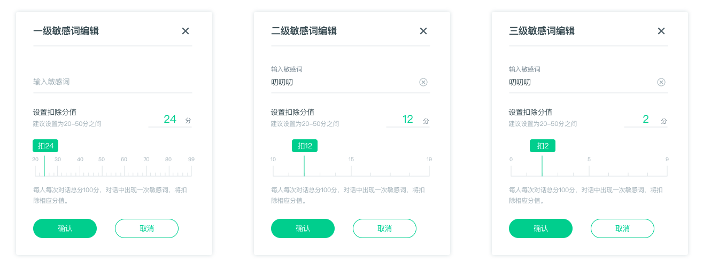
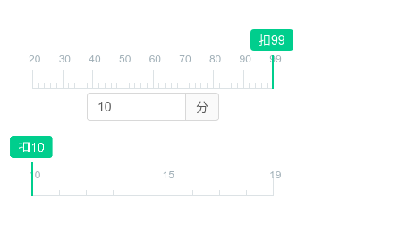

# react-ruler
A Ruler Component of React

# Why



*为了实现上面的设计，折腾了一个这样的轮子。*

### 效果如下


* 仅支持PC端
* 支持拖拽、点击来选择相应的值
* 可以和Ant-Design的Form结合
* 依赖rxjs处理事件


## Installation

### npm(还未支持)

```bash
npm install react-ruler --save
```

## Usage

## Prop types

```javascript
   propTypes: {
    value: PropTypes.number,
    start: PropTypes.number,
    end: PropTypes.number,
    step: PropTypes.number,
    handleDragChange: PropTypes.func,
   }
```


## License

[MIT][mit-license]

[mit-license]: ./LICENSE
